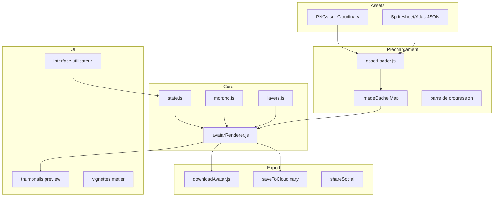

# FROX — Character Creator Canvas Research

> Techniques, librairies et approches utilisées par les meilleurs character creators (FIFA, NBA 2K, Fortnite, Saints Row) appliquées au web avec Canvas HTML5.

---

## 1. Librairies JavaScript Recommandées

### 1.1 PixiJS — Pour le rendu haute performance (WebGL)

**Quand l'utiliser :** Tu as beaucoup de calques animés, tu veux du 60 FPS sur mobile, ou tu prévois d'ajouter des effets visuels (particules, transitions, filtres).

| Critère | PixiJS |
|---|---|
| **Moteur** | WebGL/WebGPU (GPU-accéléré) |
| **Rendu PNG transparent** | ✅ Excellent — textures avec alpha blending natif |
| **Performances temps réel** | ⭐⭐⭐⭐⭐ (le plus rapide en 2D) |
| **Superposition de layers** | ✅ Containers imbriqués + `zIndex` |
| **Transformations matricielles** | ✅ scale/rotation/skew par DisplayObject |
| **Bundle size** | ~500 KB (min) |
| **Idéal pour** | Jeux, animations, avatars 3D-like en 2D |

**Exemple pour un avatar composé :**

```js
const app = new PIXI.Application({ width: 768, height: 1024 });
document.body.appendChild(app.view);

const body = PIXI.Sprite.from('corps.png');
const shirt = PIXI.Sprite.from('tenue.png');
const hair  = PIXI.Sprite.from('cheveux.png');

// Ordre des layers
app.stage.addChild(body);   // z-index 0
app.stage.addChild(shirt);  // z-index 1
app.stage.addChild(hair);   // z-index 2

// Transform
body.scale.set(0.88, 1.0);
shirt.position.set(46, 0);
```

**Limitation :** Pas de sérialisation SVG natif, pas d'événements DOM-like. Il faut gérer la détection de hit manuellement.

---

### 1.2 Konva.js — Pour l'interactivité et le contrôle des layers

**Quand l'utiliser :** Tu veux une **scene graph architecture** complète avec drag-and-drop, événements, groupes, et une API qui ressemble au DOM.

| Critère | Konva.js |
|---|---|
| **Moteur** | Canvas 2D (soft) |
| **Rendu PNG transparent** | ✅ Excellent — `Konva.Image` avec images chargées |
| **Performances temps réel** | ⭐⭐⭐⭐ (bon jusqu'à ~500 sprites) |
| **Superposition de layers** | ✅ Layers séparés avec rendu indépendant |
| **Transformations matricielles** | ✅ Transform, scale, rotation, skew |
| **Scene graph** | ✅ Groupes, parent-enfant, héritage de transformation |
| **Événements** | ✅ click, tap, drag, hover, bubbling |
| **Bundle size** | ~200 KB |
| **Idéal pour** | Éditeurs interactifs, générateurs d'avatars |

**Exemple avec layers indépendants :**

```js
const stage = new Konva.Stage({ container: 'root', width: 768, height: 1024 });
const layer = new Konva.Layer();
stage.add(layer);

// Chaque layer peut avoir son propre cache
const layerBackground = new Konva.Layer();
const layerAvatar = new Konva.Layer();
stage.add(layerBackground, layerAvatar);

// Les layers statiques sont mis en cache
layerBackground.cache();
```

**Avantage clé :** Les `Layer` sont des canvases séparés. Si tu changes juste la couleur des cheveux, seul le layer cheveux se redessine — pas tout le canvas.

**Limitation :** Pas de WebGL, donc moins performant que PixiJS avec 1000+ sprites. Mais pour un avatar avec 10-20 calques, c'est parfait.

---

### 1.3 Fabric.js — Pour l'export SVG et l'édition

**Quand l'utiliser :** Tu veux que les utilisateurs **éditent leur avatar** directement sur le canvas (sélection, resize, rotation, recolor), et exporter en SVG.

| Critère | Fabric.js |
|---|---|
| **Moteur** | Canvas 2D |
| **Rendu PNG transparent** | ✅ Très bon |
| **Performances** | ⭐⭐⭐ (bon, mais pas optimisé jeu) |
| **Interaction** | ⭐⭐⭐⭐⭐ (sélection, resize, rotate built-in) |
| **Export SVG** | ✅ ✅ ✅ Meilleur du marché |
| **Filtres** | ✅ Filtres intégrés (teinte, saturation, duotone) |
| **Bundle size** | ~300 KB |
| **Idéal pour** | Éditeurs graphiques type Canva, collage |

**Pourquoi PAS Fabric.js pour FROX ?** Le personalisateur d'avatar n'a pas besoin d'édition libre (l'utilisateur ne déplace pas les calques à la souris). Fabric.js ajoute de la complexité inutile.

---

### 1.4 Three.js (mode 2D / orthographique)

Possible mais overkill. Si un jour tu passes en 3D (rotation de personnage, éclairage), Three.js devient pertinent. Mais pour des avatars 2D superposés, non.

---

### 1.5 Recommandation FROX

| Si tu veux... | Utilise... |
|---|---|
| Juste remplacer `avatar.js` sans tout casser | **Vanilla Canvas (actuel)** — ça marche déjà |
| Une vraie refonte avec scene graph + perf | **Konva.js** — parfait pour l'interactivité + layers indépendants |
| Du rendu GPU très fluide sur mobile | **PixiJS** — si tu prévois des animations complexes |
| Édition libre + export SVG | **Fabric.js** |

Ma recommandation pour une **migration progressive** : garde Vanilla Canvas maintenant (ça fonctionne), et dans la version 2 du site, passe à **Konva.js** pour la scene graph + events + undo/redo.

---

## 2. Techniques de Layering Professionnel

### 2.1 Ordre des layers (comme dans les jeux)

Les jeux (FIFA, NBA 2K) utilisent un **ordre de rendu strict** :

```
  ┌─────────────────────────────────────┐
  │  Accessoires tête (lunettes, casque) │ → Layer 8
  ├─────────────────────────────────────┤
  │  Cheveux/Chapeau                     │ → Layer 7
  ├─────────────────────────────────────┤
  │  Yeux + Sourcils                     │ → Layer 6
  ├─────────────────────────────────────┤
  │  Visage / Barbe                      │ → Layer 5
  ├─────────────────────────────────────┤
  │  Accessoires corps (montre, gants)   │ → Layer 4
  ├─────────────────────────────────────┤
  │  Haut du corps (tenue, armure)       │ → Layer 3
  ├─────────────────────────────────────┤
  │  Jambes / Bas                        │ → Layer 2
  ├─────────────────────────────────────┤
  │  Chaussures                          │ → Layer 1
  ├─────────────────────────────────────┤
  │  Corps de base (peau, morphologie)   │ → Layer 0 (fond)
  └─────────────────────────────────────┘
```

**Bonnes pratiques des jeux :**

1. **Chaque layer est un PNG avec transparence** — pas besoin de masques complexes, chaque asset dessine uniquement sa partie
2. **Les calques sont indépendants** — changer le haut ne touche pas le corps
3. **Des trous dans les vêtements** — un t-shirt PNG doit avoir la zone de peau visible autour du cou, les bras nus
4. **Débordement contrôlé** — les cheveux longs peuvent dépasser du cadre du corps

**Cas FROX actuel :** C'est exactement cette architecture — bravo, tu as déjà fait les bons choix.

---

### 2.2 Adaptation dynamique à la morphologie (warping / matrices)

Problème : un t-shirt pour morphologie LEAN n'a pas la même taille que pour POWER.

#### Solution 1 : Transformation matricielle (la plus simple)

Chaque morphologie a des facteurs `scaleX`, `scaleY`, `translateX`, `translateY` :

```js
const MORPHO_MATRIX = {
  lean:     { sx: 0.88, sy: 1.0,  tx: 0.06, ty: 0 },
  athletic: { sx: 1.0,  sy: 1.0,  tx: 0,    ty: 0 },
  power:    { sx: 1.15, sy: 1.05, tx: -0.075, ty: 0 },
};

// Appliquer au canvas
function drawLayer(ctx, src, morpho) {
  const { sx, sy, tx, ty } = MORPHO_MATRIX[morpho];
  ctx.setTransform(sx, 0, 0, sy, tx * CANVAS_W, ty * CANVAS_H);
  ctx.drawImage(img, 0, 0, CANVAS_W, CANVAS_H);
  ctx.setTransform(1, 0, 0, 1, 0, 0); // reset
}
```

**C'est exactement ce que fait FROX actuellement.** C'est la technique standard des jeux 2D — pas besoin de warping coûteux.

⚠️ **Piège :** Si tu appliques la même matrice à TOUS les calques, les accessoires (montre, gants) se déforment aussi. Solution : ne transformer que les calques qui doivent s'adapter (corps, vêtements).

#### Solution 2 : Assets redessinés par morphologie (standard jeux AAA)

Les jeux comme FIFA/2K dessinent **chaque vêtement pour chaque morphologie**. Avantage : rendu parfait, pas de distorsion. Inconvénient : nombre d'assets ×3.

Si demain tu veux le rendu des jeux : chaque vêtement existe en 3 tailles (Lean / Athletic / Power) et tu charges celui de la morphologie actuelle.

#### Solution 3 : Mesh warping (Canvas 2D)

Pour les cas avancés (un t-shirt qui suit les contours du biceps sans être juste scalé), tu peux utiliser `ctx.transform` avec une matrice personnalisée, ou même un **mesh déformable** avec `drawImage(..., sx, sy, sw, sh, dx, dy, dw, dh)` sur 4 quadrants.

Mais pour FROX, **la matrice linéaire suffit** — les différences entre morphologies sont des proportions, pas des poses.

---

### 2.3 Couleurs de peau et carnations

Tous les jeux utilisent le même principe :

1. Assets en tons de gris ou base neutre
2. Teinte appliquée via `ctx.globalCompositeOperation` ou filtre canvas
3. Ou (mieux) : un asset PNG par carnation **avec transparence** autour

**FROX a la bonne approche** : un asset par carnation. C'est plus lourd en assets mais donne le meilleur rendu.

Technique alternative pour réduire le nombre d'assets :

```js
// Color overlay via multiply (nécessite un PNG en niveaux de gris)
ctx.globalCompositeOperation = 'multiply';
ctx.fillStyle = '#8B5A2B'; // teinte peau choisie
ctx.fillRect(0, 0, w, h);
ctx.globalCompositeOperation = 'source-over';
```

→ Mais attention : le multiply assombrit. Il faut un asset en gris clair et appliquer la teinte. Bon compromis entre qualité et nombre de fichiers.

---

### 2.4 Superposition des accessoires (Set)

Les jeux utilisent un **bitfield** ou un **Set** pour les accessoires (cf ton `state.acc_tete: new Set()`). C'est exactement la bonne approche.

**Technique pro :** Ajoute des **zones d'exclusion** entre certains accessoires :

```js
const EXCLUSIONS = {
  casquette: ['bandeau'],       // pas de casquette ET de bandeau
  lunettes:  [],                // les lunettes vont avec tout
  genouilleres: [],             // les genouillères ne bloquent rien
};

// Avant de dessiner, vérifier les exclusions
function canEquip(accessory, currentSet) {
  const blocked = EXCLUSIONS[accessory] || [];
  return !blocked.some(a => currentSet.has(a));
}
```

---

## 3. Préchargement des Assets — Performance Pro

### 3.1 Preload avec progression (ce que FROX fait déjà)

```js
async function preloadImages(onProgress) {
  const paths = getAllPaths();
  let loaded = 0;
  
  await Promise.all(paths.map(path => new Promise(resolve => {
    if (imageCache[path]) {
      loaded++; onProgress(loaded / paths.length); resolve(); return;
    }
    const img = new Image();
    img.onload = () => {
      imageCache[path] = img;
      loaded++; onProgress(loaded / paths.length);
      resolve();
    };
    img.onerror = () => { loaded++; onProgress(loaded / paths.length); resolve(); };
    img.src = path;
  })));
}
```

✅ C'est exactement ça qu'il faut faire. La version actuelle de FROX le fait bien.

### 3.2 Optimisations avancées

#### Texture Atlas / Spritesheet
Au lieu de 147 images individuelles (147 requêtes HTTP), tu COLLES toutes les images dans **une seule grande image** + une **carte de coordonnées** (JSON).

```
frox_atlas.png (4096 × 4096)

{
  "corps_homme_lean_clair1": { x: 0,    y: 0, w: 768, h: 1024 },
  "corps_homme_lean_clair2": { x: 768,  y: 0, w: 768, h: 1024 },
  ...
}
```

Chargement : 1 seule requête → 1 `decode()` → instantané.

**C'est la technique utilisée par les jeux (FIFA, Fortnite, Saints Row).**

**Outils :**
- TexturePacker
- Free Texture Packer (open source)
- Spritesheet.js

**Pour FROX :** Les PNG font ~19 KB chacun. Un atlas 4096 × 4096 peut contenir des centaines d'images. Temps de chargement divisé par ~100.

#### OffscreenCanvas (pour les transformations coûteuses)

```js
// Créer un canvas hors écran
const offscreen = new OffscreenCanvas(768, 1024);
const octx = offscreen.getContext('2d');

// Pré-rendre la base du corps avec sa morphologie
octx.clearRect(0, 0, 768, 1024);
octx.drawImage(bodyImg, ...morphoMatrix);
const cachedBody = offscreen.transferToImageBitmap();

// Dessiner sur le canvas visible
ctx.drawImage(cachedBody, 0, 0);
```

→ **Quand changer de morphologie** : recalculer seulement le cache du corps et des vêtements.

#### Image decode asynchrone

```js
const img = new Image();
img.decoding = 'async';
img.src = url;
// L'image se décode sans bloquer le thread principal
```

→ Supporté partout sauf Safari (qui le supporte aussi depuis iOS 15+).

#### Web Workers + OffscreenCanvas

Pour les transformations lourdes (changement de carnation, filtres), tu peux déléguer à un Web Worker :

```js
// worker.js
self.onmessage = (e) => {
  const { imageData, matrix } = e.data;
  const canvas = new OffscreenCanvas(768, 1024);
  const ctx = canvas.getContext('2d');
  // ... transformations ...
  self.postMessage(canvas.transferToImageBitmap());
};
```

---

## 4. Export et Sauvegarde (Download)

### 4.1 Export en PNG (FROX actuel)

```js
canvas.toBlob(blob => {
  const url = URL.createObjectURL(blob);
  const a = document.createElement('a');
  a.href = url;
  a.download = `${prenom}-frox-avatar.png`;
  a.click();
  URL.revokeObjectURL(url);
});
```

✅ C'est la technique standard.

### 4.2 Export en SVG (optionnel)

Si tu veux que les avatars soient vectoriels (redimensionnables sans perte) :
- Passe les assets en SVG
- Utilise un seul `<svg>` avec `<image>` pour contenir les PNG (SVG container)
- Ou convertis le canvas en data URI et injecte-le dans un SVG

```js
const svg = `
  <svg xmlns="http://www.w3.org/2000/svg" width="${CANVAS_W}" height="${CANVAS_H}">
    <image href="${canvas.toDataURL()}" width="${CANVAS_W}" height="${CANVAS_H}"/>
  </svg>
`;
```

---

## 5. Architecture Professionnelle — Recommandation pour la V2



**Stack recommandée V2 :**
- **Loader** : `assetLoader.js` avec atlas texture
- **Rendu** : Konva.js (scene graph) ou PixiJS (perf max)
- **État** : gestionnaire d'état dédié (Zustand, Valtio, ou simple store)
- **UI** : Framework existant (React/Vanilla)
- **Export** : `canvas.toBlob()` + upload Cloudinary automatique

---

## 6. Ce Que Tu As Déjà de Bien (et ne change pas)

| Technique FROX actuelle | Statut |
|---|---|
| Asset PNG avec transparence | ✅ Parfait |
| Cache des images en mémoire | ✅ Parfait |
| Progression du préchargement | ✅ Parfait |
| Changement de morphologie par matrice | ✅ Parfait |
| Set pour les accessoires | ✅ Parfait |
| Ordre des layers strict | ✅ Parfait |
| Export PNG | ✅ Bon |
| Mapping Cloudinary | ✅ DONE ! |

---

## 7. Prochaines Améliorations Possibles

1. **Texture atlas** → 147 requêtes HTTP deviennent 1
2. **Konva.js** pour les layers indépendants (undo/redo-friendly)
3. **Undo/redo stack** pour l'U
4. **Historique des avatars** en localStorage
5. **Download avec template** (nom + avatar + stats)
6. **Sauvegarde dans un compte utilisateur**
7. **Partage social avec Canvas généré**

---

_

---

## 8. Projets Open Source GitHub — Analyse comparative

### 8.1 Projets Web Canvas/Layers (les plus pertinents pour FROX)

#### [Gacha Design Studio](https://github.com/archanaberry/Gacha-Design-Studio) ⭐ ~100
- **Stack :** JavaScript Vanilla + Canvas
- **Architecture :** Système de layers avec SVG, chaque couche a position, rotation, scale, skew, flip, opacity, couleur par recolor
- **Structure :** 
  ```js
  const layers = [
    { layerName: "Torso", src: ["outline.svg", "color.svg"],
      options: { posX, posY, rotation, scale, flipX, color0, color1 } }
  ];
  ```
- **Ce qui est intéressant :** Chaque layer peut avoir plusieurs sources (outline + couleur), avec des `color0`, `color1`, `color0g0` pour le gradient. Le système de transformation est complet (skew, flip, scale, rotation).
- **Ce qui est limité :** Utilise exclusivement du SVG, pas de PNG. Architecture un peu bordélique (projet fanmade indonésien).

#### [Top Down Sprite Maker (TDSM)](https://github.com/jbunke/tdsm) ⭐ ~200
- **Stack :** Java (desktop), mais son architecture est remarquable
- **Ce qui est intéressant :** Supporte **plusieurs styles de sprites** interchangeables (comme des thèmes). Chaque sprite style définit ses propres animations, layers, options de personnalisation, dimensions.
- **Smart layering :** Les layers se mettent à jour dynamiquement — changer le body type met automatiquement à jour les vêtements pour fitter
- **Randomization contrainte :** On peut locker certains layers et randomiser le reste
- **Export :** Spritesheet PNG + métadonnées JSON. Possibilité de re-importer un sprite via son JSON
- **Pour FROX :** L'idée de "sprite styles" interchangeables est excellente pour plus tard (skin FROX, skin HYROX, skin équipements sponsor)

#### [Avataaars Generator](https://github.com/fangpenlin/avataaars-generator) ⭐ ~400
- **Stack :** React + SVG
- **Live :** [getavataaars.com](http://getavataaars.com)
- **Design :** Illustration vectorielle signée Pablo Stanley (Figma)
- **Ce qui est intéressant :** Composant React réutilisable. Plus de 180 combinaisons (cheveux, accessoires, vêtements). Très bonne démo de ce qu'un avatar builder SVG peut faire.
- **Pour FROX :** Prouve que l'approche SVG est viable pour les avatars vectoriels stylisés, mais FROX a une approche photo-réaliste (PNG), donc Canvas reste meilleur.

### 8.2 Projets SVG-Based (identicons, génération algorithmique)

#### [Multiavatar](https://github.com/multiavatar/Multiavatar) ⭐ ~2 500
- **Stack :** Vanilla JS + SVG
- **Concept :** Générateur d'avatar multicultural. 48 personnages initiaux → 12 milliards d'avatars uniques.
- **Architecture :** 6 parties (Environment, Clothes, Head, Mouth, Eyes, Top). Chaque partie peut venir de n'importe lequel des 48 personnages initiaux.
- **Calcul :** Hash SHA-256 du nom → 6 nombres (00-47) → sélection des parties + thème de couleur
- **Export :** SVG, PNG via API
- **Pour FROX :** Pas directement applicable (génération déterministe, pas de personnalisation interactive). Mais l'approche "composition par hash" peut servir pour les identicons utilisateur.

#### [Boring Avatars](https://github.com/boringdesigners/boring-avatars) ⭐ ~5 500
- **Stack :** React + SVG
- **Concept :** Avatars SVG générés à partir d'un username + palette. Parfait pour les placeholders.
- **Variantes :** Marble, Beam, Sunset, Ring, Bauhaus, Pixel
- **Pour FROX :** Rien à voir, mais c'est le plus populaire — prouve que l'avatar génératif a un marché.

#### [Vue Color Avatar](https://github.com/Codennnn/vue-color-avatar) ⭐ ~3 500
- **Stack :** Vue 3 + Vite
- **Live :** [vue-color-avatar.leoku.dev](https://vue-color-avatar.leoku.dev)
- **Design :** Basé sur le même Figma que Avataaars (Avatar Illustration System de Micah Lanier, CC BY 4.0)
- **Ce qui est intéressant :** 
  - Barre de configuration visuelle
  - Génération aléatoire
  - **Redo/Undo**
  - i18n
  - Génération en batch
  - Docker support
- **Pour FROX :** L'architecture Vue + composants + undo/redo est ce qu'il faudrait pour la V2. Le batch generation est aussi une feature intéressante.

#### [react-nice-avatar](https://github.com/dapi-labs/react-nice-avatar) ⭐ ~1 000
- **Stack :** React + SVG
- **Live :** [nice-avatar.chilllab.io](https://nice-avatar.chilllab.io)
- **API élégante :** `const config = genConfig("email@example.com")` → avatar cohérent. `genConfig({ sex: "man", hairStyle: "mohawk" })` → custom.
- **Options :** sex, faceColor, earSize, hairColor, hairStyle, hatStyle, eyeStyle, glassesStyle, noseStyle, mouthStyle, shirtStyle, bgColor…
- **Pour FROX :** L'API par configuration est un modèle à suivre pour la refonte.

#### [Avatar Maker (Vue)](https://github.com/favrora/Avatar-Maker) ⭐ ~500
- **Stack :** Vue 2 + SVG
- **Live :** [avatarx.netlify.app](https://avatarx.netlify.app)
- **Concept :** Avatar par combinaison de parties SVG. Très simple, code facile à comprendre. Download PNG.
- **Pour FROX :** Preuve qu'un avatar maker peut être simple et efficace.

### 8.3 Projets 3D

#### [MakeHuman.js](https://github.com/makehuman-js/makehuman-js) ⭐ ~200
- **Stack :** Three.js (WebGL)
- **Concept :** Port du logiciel MakeHuman (générateur de corps humain 3D) dans le navigateur
- **Ce qui est intéressant :** Morphing 3D temps réel, sliders pour chaque partie du corps
- **Pour FROX :** Overkill pour des avatars 2D, mais si un jour tu passes en 3D, c'est une base. Licence AGPL (attention).

### 8.4 Pourquoi il n'y a pas de "FIFA-like" en open source web

Les gros character creators (FIFA, NBA 2K, Saints Row, Fortnite) utilisent :
- **Moteurs 3D propriétaires** (Unreal, Frostbite, RenderWare)
- **Skeletal mesh blending** (morph targets sur des squelettes 3D)
- **Texture atlases** avec milliers de combinaisons
- **Systèmes d'animation complexes** (blend trees, IK)

En open source web, l'état de l'art pour le **même rendu** serait :
1. Three.js avec des meshes humains (type MakeHuman)
2. Des textures superposées en WebGL (PixiJS)
3. Mais ça reste très en dessous de ce que les moteurs de jeux savent faire

→ Les approches SVG + Canvas PNG sont le bon compromis web pour un rendu propre sans plonger dans la 3D.

### 8.5 Leçons pour FROX

| Leçon | Projet | Application FROX |
|---|---|---|
| API par configuration | react-nice-avatar | `genConfig(seed)` pour la cohérence avatar-utilisateur |
| Undo/Redo | vue-color-avatar | À ajouter dans la V2 |
| Smart layering | TDSM | Les vêtements suivent la morpho automatiquement |
| Randomisation contrainte | TDSM | Permettre de locker certains éléments et randomiser le reste |
| Multi-sources par layer | Gacha Studio | Un layer = outline + fill + texture séparés |
| Assets interchangeables | TDSM | "Sprite styles" par édition (FROX, HYROX Pro, Équipe) |
| Docker deploy | vue-color-avatar | `docker build` simple pour déploiement Railway |
| Batch generation | vue-color-avatar | Générer plusieurs avatars pour une équipe |
| Identicon déterministe | Multiavatar | Lier l'avatar au nom du user |

---

_Document compilé le 13 juin 2026 — pour le projet FROX Hyrox Le Havre._

### Annexes — Liens GitHub rapides

| Projet | Stars | Stack | Lien |
|---|---|---|---|
| Boring Avatars | ⭐ 5.5k | React + SVG | [github](https://github.com/boringdesigners/boring-avatars) |
| Vue Color Avatar | ⭐ 3.5k | Vue 3 + SVG | [github](https://github.com/Codennnn/vue-color-avatar) |
| Multiavatar | ⭐ 2.5k | Vanilla JS + SVG | [github](https://github.com/multiavatar/Multiavatar) |
| react-nice-avatar | ⭐ 1k | React + SVG | [github](https://github.com/dapi-labs/react-nice-avatar) |
| Avatar Maker | ⭐ 500 | Vue 2 + SVG | [github](https://github.com/favrora/Avatar-Maker) |
| Avataaars | ⭐ 400 | React + SVG | [github](https://github.com/fangpenlin/avataaars-generator) |
| TDSM | ⭐ 200 | Java (desktop) | [github](https://github.com/jbunke/tdsm) |
| MakeHuman.js | ⭐ 200 | Three.js 3D | [github](https://github.com/makehuman-js/makehuman-js) |
| Gacha Design Studio | ⭐ ~100 | Vanilla JS + SVG | [github](https://github.com/archanaberry/Gacha-Design-Studio) |
| Profile Picture Maker | ⭐ 0 | JavaScript | [github](https://github.com/tawhidurrahmandear/profile-picture-maker) |

